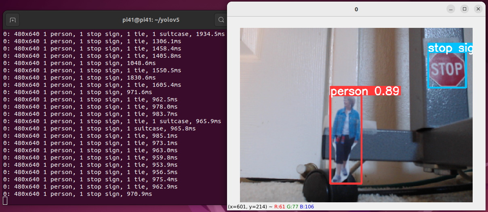
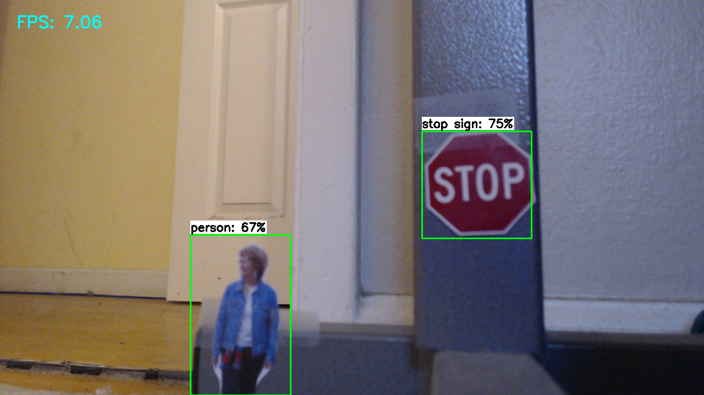
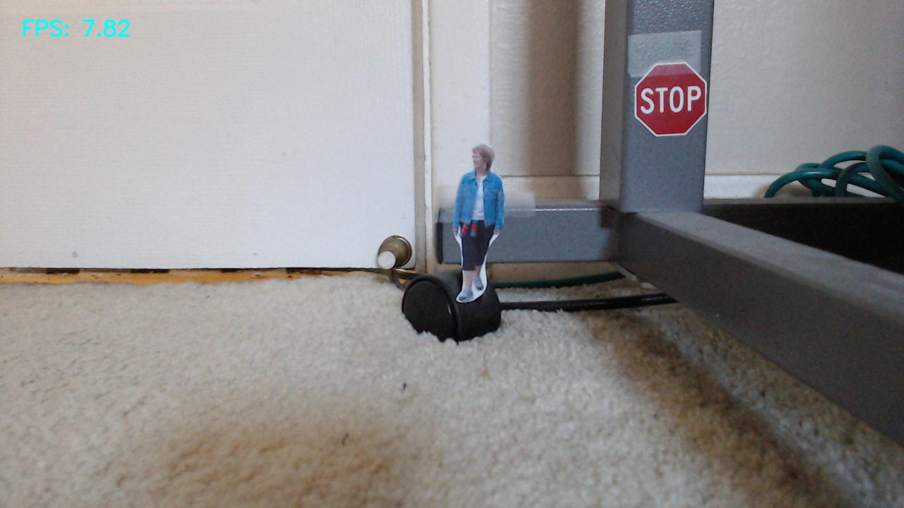

# Camera Object Detection Model

- This folder contains the files needed to run the inference models for Mobilenet-SSD and YOLOv5

- Each model has been trained on the MSCOCO dataset which has 80 classes including the 3 classes our group are conerned with: Person, Stop sign, and Ball
- The models were then converted into tflite compatible models and also quantized from 32-bit floating point to 8-bit integer weights and biases. Both changes were made in order for the model to run more effectively on lower power hardware such as the Jetson Nano and the Raspberry Pi

## Model Comparison

### YOLOv5

The YOLOv5 object detection model has an average latency of just around 1100 milliseconds when running on the Rasberry Pi

The model was easily able to detect both the stop sign and the person at around 8 inches from the objects.

#### Instructions
- To run YOLOv5 object detection using a usb webcam interface, install the proper python libraries and run the following command

`python3 detect.py --source 0`

### Mobilenet

The Mobilenet object detection model has an average latency of just around 150 milliseconds when running on the Rasberry Pi

The model was also easily able to detect both the stop sign and the person starting at around 6 inches from the objects.

The above image shows that at around 14 inches from the objects, the model was not able to detect the person or the stop sign.

#### Instructions
- To run Mobilenet object detection using a usb webcam interface, install the proper python libraries and run the following command

`python3 TFLite_detection_webcam.py --modeldir=Sample_TFLite_model`

### Credits

YOLOv5 model adapted from ultralytics' github: https://github.com/ultralytics/yolov5

Mobilenet-SSD model adapted from EdjeElectronics' github: https://github.com/EdjeElectronics/TensorFlow-Lite-Object-Detection-on-Android-and-Raspberry-Pi
