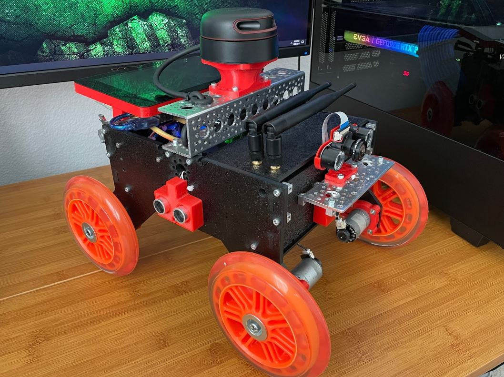

# Integrated Sensor Miniature Car
#### CMPE-249 Project by: Aaron Choi, Albert Giang, and Nelson Paz

The objective of this project is to create a small autonomous vehicle which uses various sensors to navigate its environment

More information on the project can be found in the Google Slide presentation and the project paper
- Slides: https://docs.google.com/presentation/d/1Il38DK8mRE800kGbPi1jwqJwAlsxUYbRhMcizE27qTE/edit?usp=sharing
- Paper: https://docs.google.com/document/d/1tg4abGuXoLujmSE-XfjGU3LCdVXYlsYdrjaigfV42bo/edit?usp=sharing

## This github contains files, code, and models used in this project. Each folder has their own readme with more information on the work done and files contained

#### 3D_Printed_Parts folder
- Contains the STL files for the parts that were designed and fabricated for this project

#### Camera_Models folder
- Contains the two object detection models that were considered for this project

#### Images folder
- Contains the jpgs that are displayed in the readme files

#### Lidar_Models folder
- Contains the code needed to run the Simultaneous Localization And Mapping (SLAM) model

#### Motion_Files folder
- Contains the code needed for the Arduino to drive the motor controller

#### System Wiring Image

